# 前言
该项目原名是pig-video，做了爬取短视频功能。后面因为自己上班有时忘记写日报，做了计划管理功能，备忘录功能，做成了chrome插件形式。因为基础框架采用是springcloud，更改为pig-cloud。最初取名为pig-video，是因为是2019年，刚好是己亥年。与pig-x和lengleng的pig-cloud重名纯属巧合:sweat_smile:。我也是搜自己的pig-cloud，才知道有这个项目的。

# 功能截图

## 1.插件安装

需要先下载前端项目 https://github.com/gaozhen1996/pig-cloud-ui ，具体安装，打包可以看这个项目，打包完成后可以看到有dist目录

打开chrome的【更多工具-扩展程序】

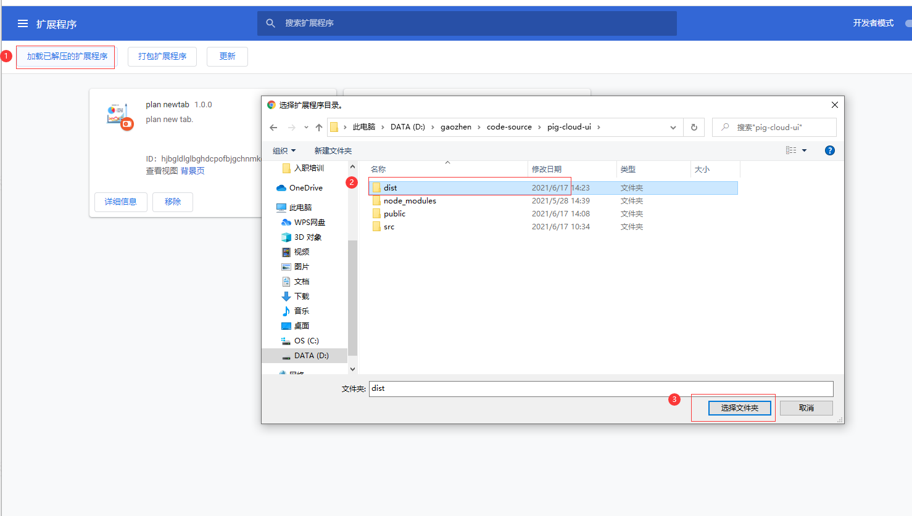

## 2.登陆

第一次使用需要先登录

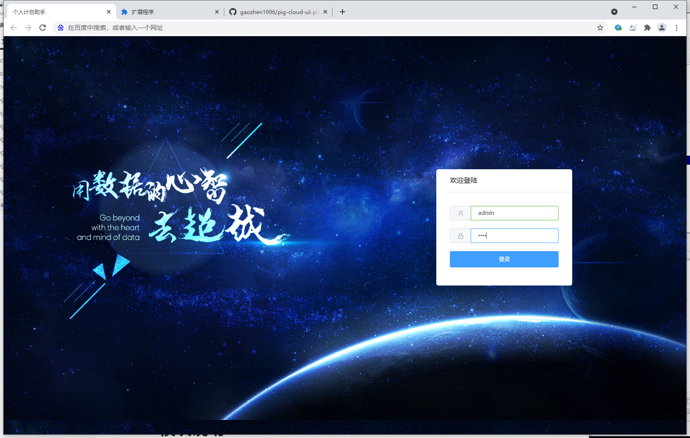

## 3.计划模块

新增计划

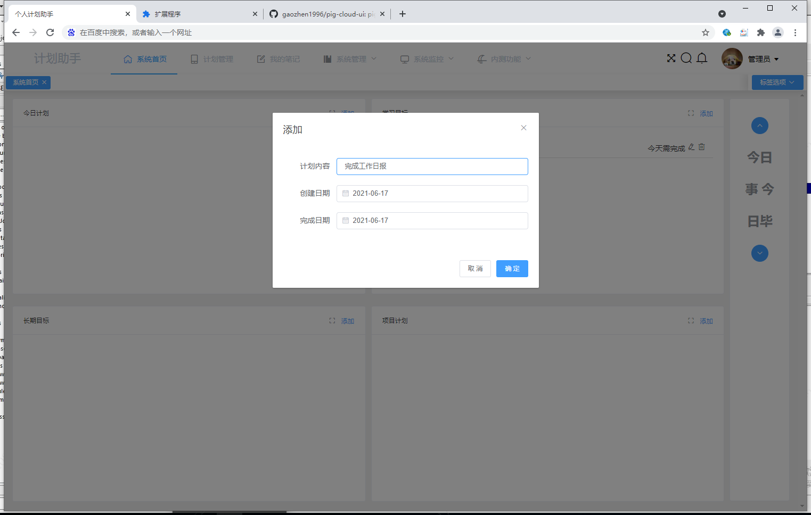

拖拽计划到另外的项目中

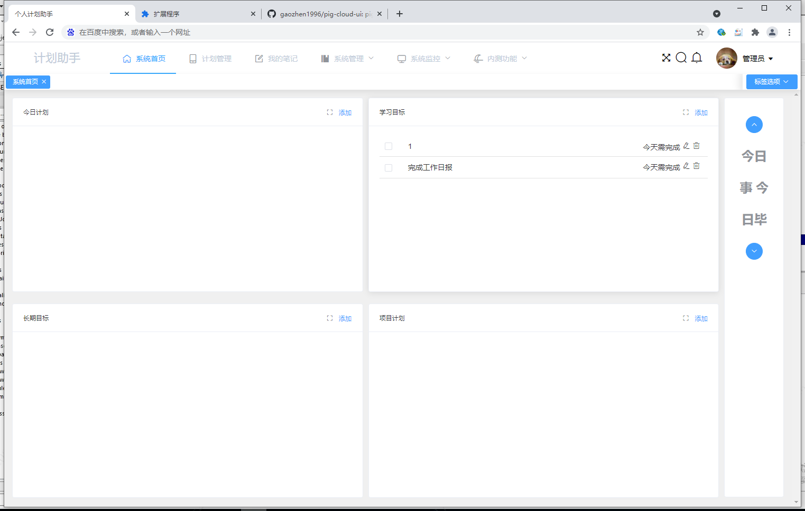

延期提醒

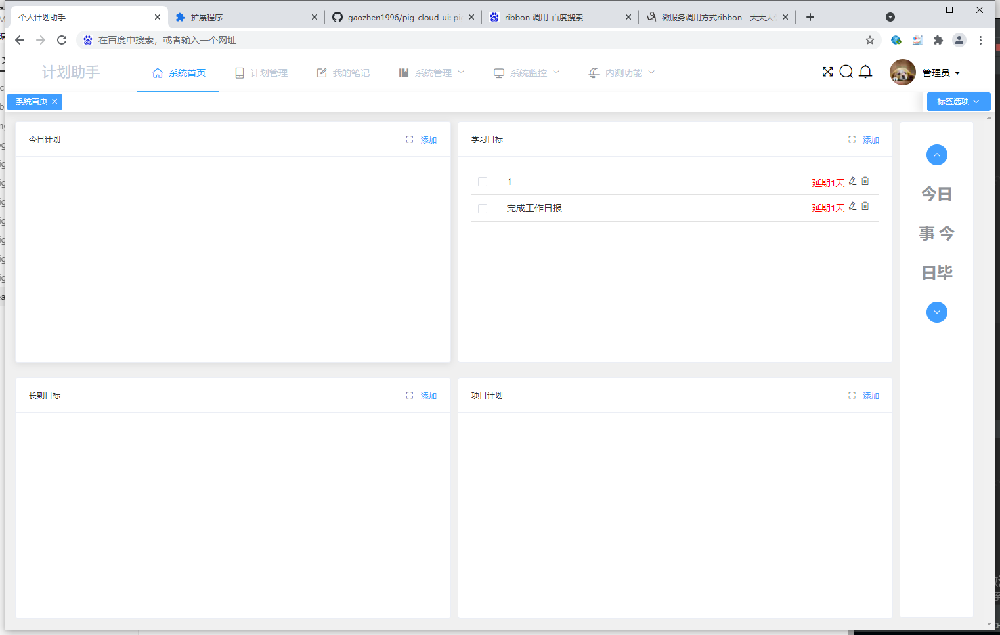

## 4.备忘录

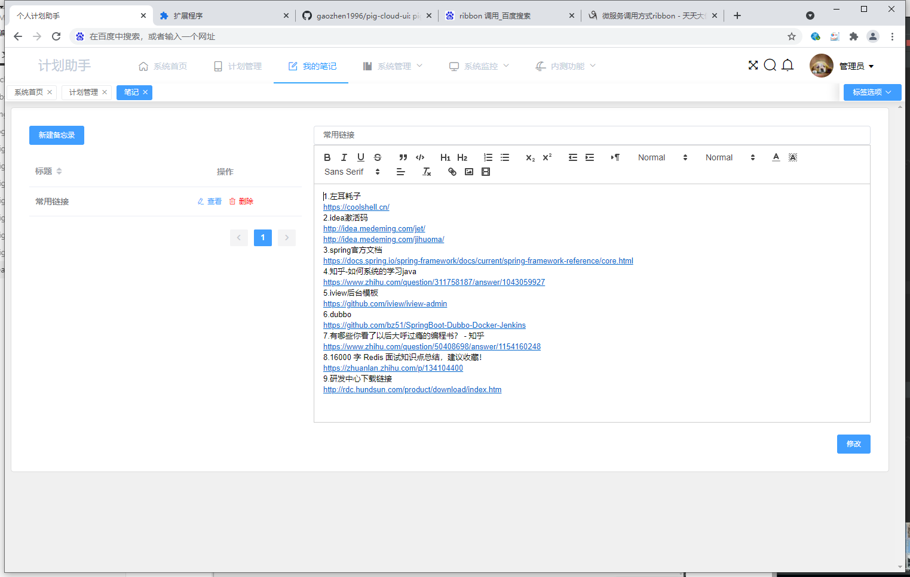

## 5.壁纸设置

上下结构:将菜单栏设置在上侧

左右结构:将菜单栏设置在左侧

背景设置:可以修改壁纸，支持自定义。

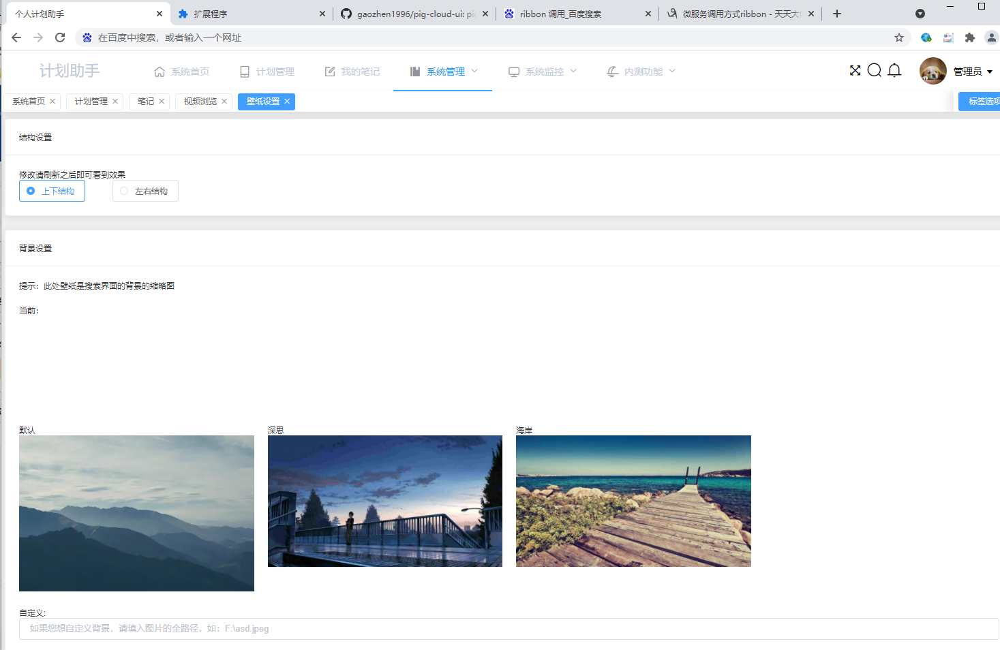

## 6.快捷方式

快捷方式管理

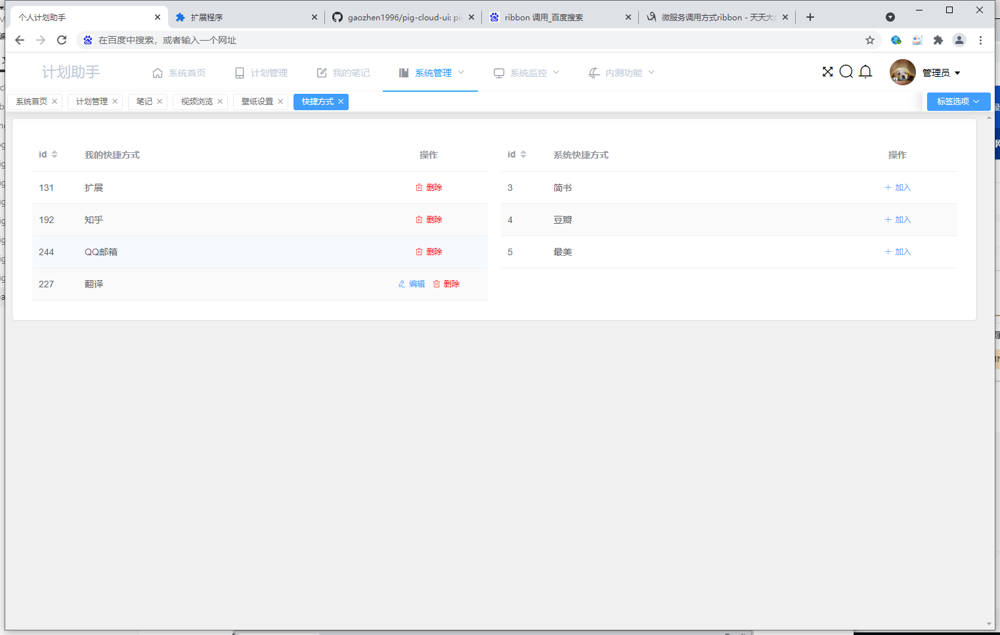

添加快捷方式

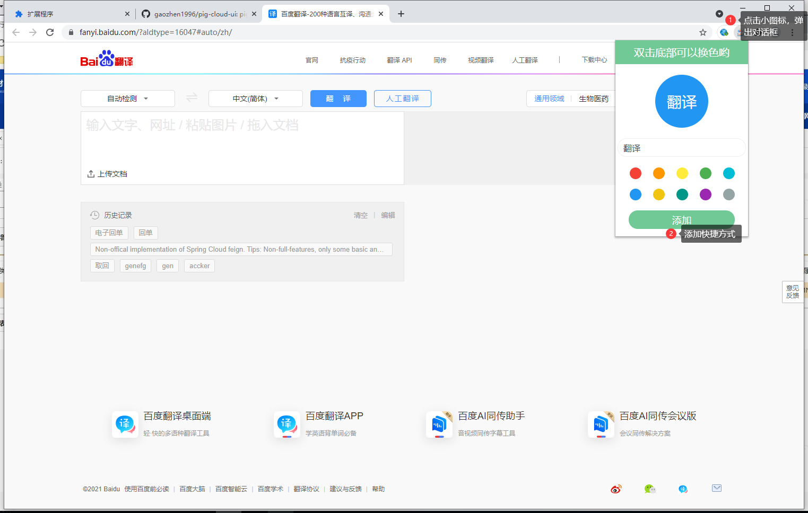

## 7.浏览器桌面

刚刚提添加的百度翻译快捷方式添加好了，点击则跳转到百度界面

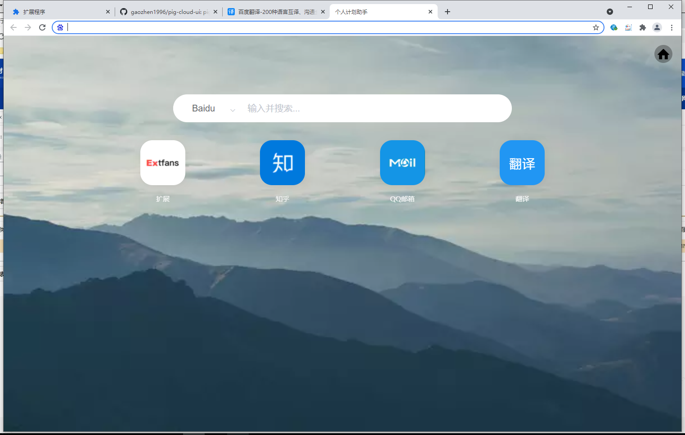

在背景界面换背景

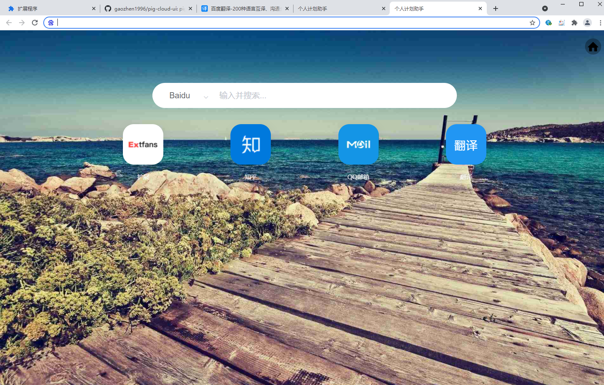

# 快速运行

- 运行dbscript的SQL脚本

- 下载consul，并运行起来（免安装）

- 运行pig-cloud-gateway项目

- 运行pig-cloud-auth-service (这个服务在master分支是使用golang改写的，如果想使用java版本可以拉取java分支)

  - 如果运行golang版本，在pig-cloud-auth-service执行go run main.go即可

- 运行其他的服务（pig-cloud-plan-service等等）

- 运行pig-cloud-ui项目

  

  

  

  

  

  

  

